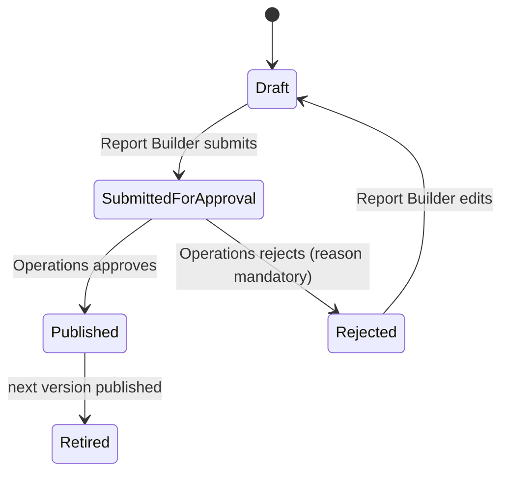
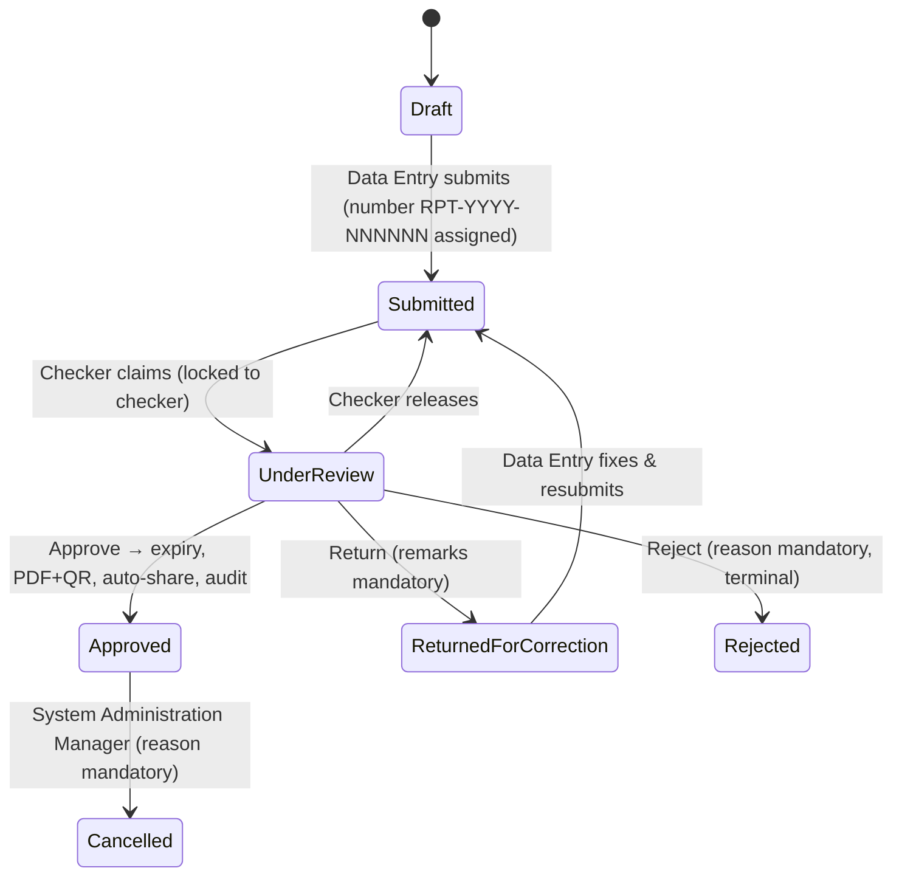

# Medical Reports Management System (MRMS)

نظام إدارة التقارير الطبية — a full-stack web application where report templates are designed
through a UI-based Form Builder, filled by Data Entry users, validated and approved by Checkers,
then **automatically shared** with external entities via Push delivery and/or a Pull Inquiry API,
according to sharing settings configured on each template.

**Stack:** Node.js + Express · SQLite (`better-sqlite3`) · React (Vite) · JWT + bcrypt ·
Playwright print-to-PDF (Arabic RTL) · `qrcode`

Monorepo layout:

```
medical-reports-system/
├── server/          # Express REST API, SQLite DB, PDF/QR, sharing engine
│   ├── src/         # routes, services, lib, seed
│   ├── scripts/     # e2e.mjs — end-to-end exercise of the DoD flows
│   ├── uploads/     # file-attachment storage
│   └── generated/   # generated PDFs
├── client/          # React SPA (bilingual AR/EN, full RTL)
├── ASSUMPTIONS.md
└── SEED.md
```

## Run

```bash
npm install
npx playwright install chromium   # one-time: browser for PDF generation
npm run seed                      # create + seed the SQLite database
npm run dev                       # server on :4000, client on :5173
```

Open http://localhost:5173 and sign in with any seed user (see `SEED.md` — password `Passw0rd!`).
The public verification page is `/verify/{reportNumber}?h={hash}` (linked from each approved
report and encoded in the PDF's QR code). The Entity Simulator page (Operations sidebar) shows
webhook payloads received on `POST /api/simulator/webhook`.

To verify the whole flow non-interactively: with the server running on a freshly seeded DB,
`node server/scripts/e2e.mjs` exercises every Definition-of-Done path (59 checks).

## Roles & permission matrix

Permission formula for report access: **Role × Assigned Report Types × Assigned Facilities**
(BR-R2, BR-R3). Exactly one role per user (BR-R1).

| # | Role | Capabilities | Report-type scope | Facility scope |
|---|------|--------------|-------------------|----------------|
| 1 | Data Entry (مدخل البيانات) | Create/fill/edit own drafts & returned reports, submit | Assigned | Assigned |
| 2 | Checker (المدقق) | Review submitted reports: Approve / Return with remarks / Reject | Assigned | Assigned |
| 3 | System Manager (مدير النظام) | Read-only browse/search + dashboard | Assigned | Assigned |
| 4 | System Administration Manager (مدير إدارة النظام) | Read-only + dashboard + **only role able to Cancel an approved report** (BR-R6) | Assigned | **ALL** (implicit) |
| 5 | Report Builder (باني التقارير) | Form Builder: templates, fields, validation, conditional logic, validity, duplicate prevention, sharing settings | — | — |
| 6 | Operations (العمليات) | Users, Facilities, Entities (+API credentials), **Template approval**, Sharing Log | — | — |

## Template lifecycle



Published versions are immutable; editing creates version N+1 in Draft. Reports keep the version
they were created with for **form structure/rendering**, but **sharing / validity / duplicate
settings are live at report-type level** — the latest Published version governs all reports of
the type (Push is never retroactive; Pull visibility is computed dynamically).

## Report lifecycle



Approved content is read-only forever. Cancellation pushes `report.cancelled` to entities that
received the original push, flips the verification page / Inquiry API to **Cancelled**, and stops
blocking duplicates. Cancelled reports cannot be un-cancelled.

## Inquiry API — `/api/external/v1`

Authentication: HTTP Basic with **Client ID + Client Secret** (generated by Operations per
entity; secret stored hashed, shown once). Every call is audited (entity, endpoint, query key,
result count, timestamp, IP).

| Endpoint | Description |
|----------|-------------|
| `GET /api/external/v1/reports?reportNumber=RPT-2026-000004` | Fetch one report by number |
| `GET /api/external/v1/reports?idType=national_id&idNumber=1034567890` | List reports for an examinee |

Both return only Approved reports **pull-visible to the calling entity** per current sharing
settings and within the entity's report-type scope. Each result carries
`validity_status: Valid | Expired | Cancelled`, full field data with EN/AR labels, and a
`pdf_url`. Errors: `401` invalid credentials · `403` pull channel disabled · `404` not
found / not shared · `400` missing parameters.

```bash
curl -u "ent_moh_pull_demo:pull-demo-secret-12345" \
  "http://localhost:4000/api/external/v1/reports?reportNumber=RPT-2026-000004"
```

## Key business rules (referenced in code as BR-x)

- **BR-R1** exactly one role per user; **BR-R2/R3** scope filtering + 403 on out-of-scope access,
  including direct ID access; **BR-R4** Data Entry edits own Draft/Returned only;
  **BR-R5** a checker never decides on a report they created; **BR-R6** cancel = System
  Administration Manager only, reason mandatory.
- **BR-T6** a template with no sharing settings stays internal (no push, not pull-visible).
- **BR-DUP** duplicate prevention blocks a new report of the same type for the same examinee
  while one exists in Draft/Submitted/Under Review/Returned, or Approved and still valid.

## Verification & PDF

On approval the server generates a bilingual PDF (Playwright print-to-PDF, correct Arabic RTL)
with a QR code encoding `/verify/{reportNumber}?h={hash}`. The public verification page shows
only: validity result (Valid / Expired / Cancelled / Invalid hash), report number, template,
facility, approval/expiry dates, and a masked examinee ID — never medical data.
